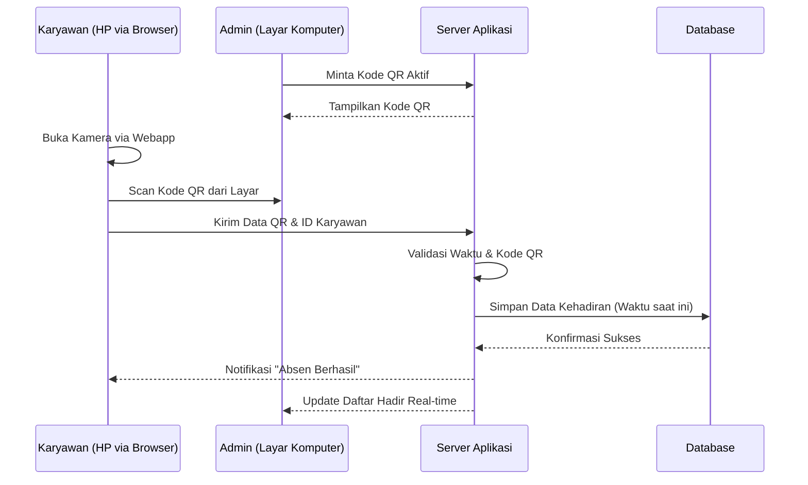
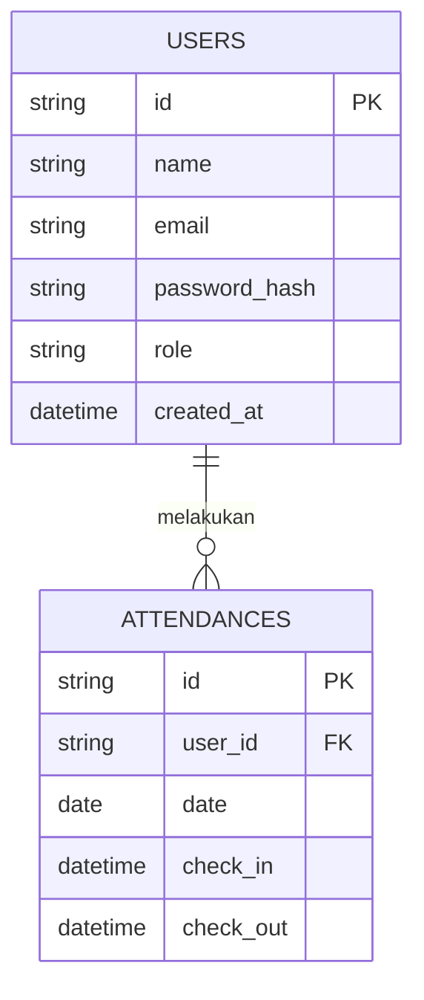

# PRD — Project Requirements Document

## 1. Overview
Proses absensi manual seringkali tidak efisien, memakan waktu, dan rentan terhadap kesalahan, terutama untuk skala perusahaan dengan jumlah karyawan 50 hingga 200 orang. Proyek ini bertujuan untuk membangun sebuah Aplikasi Web (Webapp) Absensi Berbasis QR yang sederhana namun efektif. 

Aplikasi ini akan memungkinkan admin untuk menampilkan kode QR, dan karyawan dapat melakukan absensi (Check-in/Check-out) cukup dengan memindai (scan) kode QR tersebut menggunakan kamera HP pribadi mereka melalui browser web. Sistem ini dirancang untuk kemudahan penggunaan, pencatatan waktu yang akurat, dan pelaporan yang mudah diekstrak ke dalam format Excel/CSV untuk keperluan penggajian.

## 2. Requirements
- **Kapasitas Pengguna:** Sistem harus mampu menangani aktivitas absensi harian untuk 50 - 200 karyawan tanpa kendala.
- **Aksesibilitas Perangkat:** Aplikasi harus sangat responsif dan dapat diakses dengan lancar melalui browser di HP pribadi karyawan (Mobile-first design) serta laptop/PC untuk Admin.
- **Autentikasi:** Sistem login standar menggunakan kombinasi Email dan Password.
- **Metode Absensi:** Karyawan bertindak sebagai pemindai (scanner) kode QR yang disediakan oleh pihak kantor/admin. Tidak perlu ada pelacakan lokasi (GPS/Geofencing).
- **Ekspor Data:** Kemampuan untuk mengunduh rekap absensi dalam format file Excel atau CSV.
- **Keamanan Dasar:** Memerlukan koneksi HTTPS agar fitur kamera pada web (untuk memindai QR) dapat diizinkan oleh perangkat pengguna.

## 3. Core Features
- **Manajemen Akun (Auth):**
  - Login dan Logout untuk dua jenis peran ganda: Admin dan Karyawan.
- **Dashboard Admin:**
  - **Generator QR:** Menampilkan kode QR absensi di layar. (Kode QR idealnya diperbarui otomatis setiap beberapa detik/menit untuk mencegah karyawan memfoto QR dan absen dari rumah).
  - **Manajemen Karyawan:** Menambah, mengedit, atau menghapus data karyawan.
  - **Monitoring Real-time:** Melihat daftar karyawan yang sudah absen pada hari tersebut.
  - **Ekspor Laporan:** Mengunduh data absensi berdasarkan rentang tanggal tertentu ke format Excel/CSV.
- **Interface Karyawan:**
  - **QR Scanner:** Pemindai QR internal yang menggunakan kamera HP untuk melakukan Check-in dan Check-out.
  - **Riwayat Log:** Halaman sederhana bagi karyawan untuk melihat riwayat kehadiran mereka sendiri.

## 4. User Flow
**Alur Admin:**
1. Admin membuka aplikasi web di komputer/tablet dan melakukan Login.
2. Admin membuka menu "QR Absensi Hari Ini" dan menampilkan layar tersebut di area pintu masuk kantor.
3. Di akhir bulan/minggu, Admin masuk ke menu "Laporan", memilih tanggal, dan mengklik "Download Excel".

**Alur Karyawan:**
1. Karyawan tiba di kantor, membuka website absensi di browser HP pribadi.
2. Karyawan melakukan Login (jika sesi sebelumnya sudah berakhir).
3. Karyawan menekan tombol "Scan Absen". Webapp akan meminta izin akses kamera.
4. Karyawan mengarahkan kamera HP ke layar QR yang ditampilkan Admin.
5. Layar HP menampilkan pesan "Absen Berhasil" beserta waktu kehadiran.

## 5. Architecture
Sistem ini menggunakan arsitektur Monolitik Fullstack Modern di mana Frontend (tampilan) dan Backend (logika server) berada dalam satu kesatuan kode aplikasi.

- **Klien (Browser/HP):** Menangani antarmuka pengguna dan akses kamera perangkat untuk membaca susunan kode QR.
- **Server:** Menerima data dari klien, memvalidasi apakah kode QR tersebut sah, dan mencatat waktu server secara otomatis.
- **Database:** Menyimpan data pengguna dan riwayat waktu absensi.

## 6. Database Schema
Untuk mendukung sistem ini, kita membutuhkan dua tabel utama: `users` untuk menyimpan profil pengguna, dan `attendances` untuk mencatat log absen harian.

**1. Tabel `users` (Data Pengguna)**
- `id` (String/UUID): ID unik untuk setiap pengguna.
- `name` (String): Nama lengkap karyawan/admin.
- `email` (String): Alamat email untuk keperluan login.
- `password_hash` (String): Kata sandi yang sudah dienkripsi.
- `role` (String): Peran pengguna, berisi nilai "ADMIN" atau "EMPLOYEE".
- `created_at` (Timestamp): Waktu akun dibuat.

**2. Tabel `attendances` (Data Absensi)**
- `id` (String/UUID): ID unik catatan absensi.
- `user_id` (String): Merekam ID Karyawan yang melakukan absen (Relasi ke tabel `users`).
- `date` (Date): Tanggal absensi dilakukan (untuk mempermudah pencarian dan filter rekap).
- `check_in` (Timestamp): Waktu saat karyawan absen masuk.
- `check_out` (Timestamp): Waktu saat karyawan absen pulang (Bisa kosong jika belum pulang).

## 7. Tech Stack
Berikut adalah rekomendasi teknologi berbasis *resource-friendly* (mudah dikembangkan dan hemat biaya) yang sangat cocok untuk aplikasi skala 50-200 pengguna:

- **Frontend & Backend (Framework App):** **Next.js**. Menangani tampilan antarmuka (UI) sekaligus menyediakan API (jalur data) di balik layar dalam satu sistem.
- **Styling & UI Component:** **Tailwind CSS** (untuk mempercantik desain secara instan) dan **shadcn/ui** (komponen antarmuka siap pakai yang terlihat profesional).
- **Pembaca QR (Klien):** Pustaka JavaScript ringan seperti `html5-qrcode` atau `react-qr-reader` untuk mengaktifkan akses kamera di browser.
- **Generasi Excel/CSV:** Pustaka seperti `xlsx` atau `csv-writer` untuk membuat file ekspor laporan admin.
- **Autentikasi:** **Better Auth**. Sistem keamanan login yang cepat dikonfigurasi dan aman untuk metode Email/Password.
- **Database:** **SQLite**. Sangat cepat, gratis, dan sangat mumpuni untuk menyimpan data absensi hingga ribuan entri per bulan. (Opsional bisa dinaikkan ke PostgreSQL jika dirasa kurang di masa depan).
- **Database ORM:** **Drizzle ORM**. Alat penghubung logika server ke database yang aman, ringan, dan cepat.
- **Deployment & Hosting:** **Vercel** (untuk menjalankan Next.js secara optimal) atau layanan VPS lokal jika data diharuskan berada di jaringan kantor.